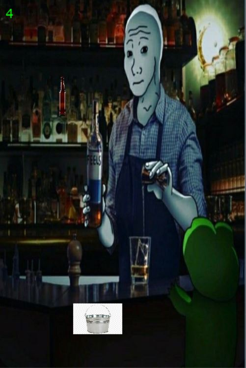

# Bottle Catcher Game

## Description

Bottle Catcher is a simple 2D game implemented using the Pygame library in Python. The objective of the game is to control a player character (the bucket) to catch falling bottles while avoiding collisions with them. The game becomes progressively more challenging as the speed of falling bottles increases over time.

## Features

- Control the player character using the left and right arrow keys.
- Catch falling bottles using the player character (bucket).
- The game speed gradually increases, making it more challenging.
- Your score increases with each successfully caught bottle.
- Background music and sound effects for bottle collisions.
- Random spawning of bottles from the top of the screen.

## Requirements

- Python 3.x
- Pygame library (`pip install pygame`)

## Installation

1. Clone the repository or download the source code as a ZIP file.
2. Install the required dependencies using `pip`: pip install pygame
3. Run the game by executing the `bottle_catcher.py` script: python bottle_catcher.py

## How to Play

1. Launch the game using the instructions in the Installation section.
2. Use the left and right arrow keys to move the player character (bucket) horizontally.
3. Catch falling bottles by moving the player character beneath them.
4. Avoid collisions between the player character and falling bottles.
5. Your score increases each time you catch a bottle.
6. The game speed gradually increases, making it more challenging to catch bottles.

## Controls

- Left Arrow Key: Move the player character to the left.
- Right Arrow Key: Move the player character to the right.
- Escape Key: Close the game.

## Credits

- Game assets (images, sounds) by [Your Name]
- Background music: [Music Source]
- Sound effects: [Sound Effects Source]

## License

This project is licensed under the [MIT License](LICENSE).

## Acknowledgments

- Pygame library: [Pygame Official Website](https://www.pygame.org/)